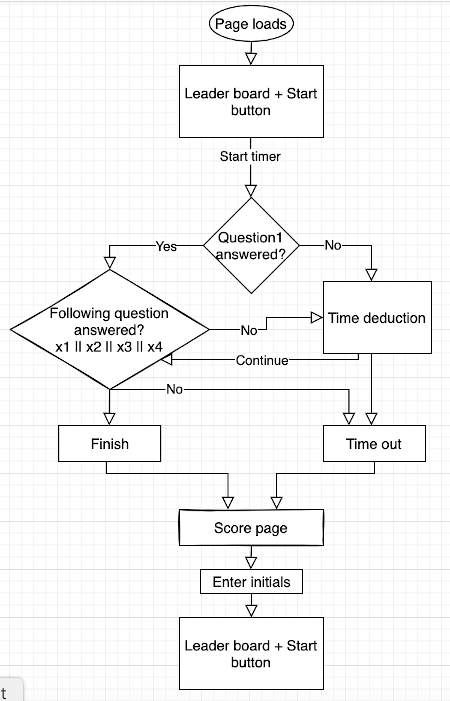
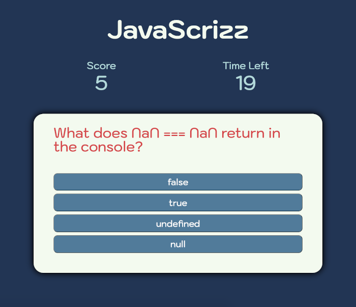
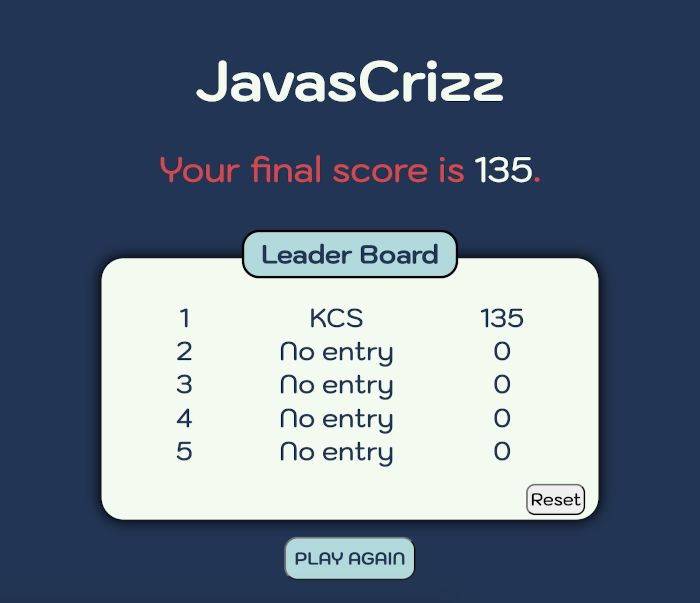

Javascrizz is a browser-based interactive quiz game that tests user's javascript knowledge.

### How to play

---

Load the page on the browser. Click on start button and choose the correct answer for each question. The game is timed. If a wrong answer is chosen, the time is deducted accordingly.

### Game design

---

The game includes the following features:

- Clickable questions and leaderboard
- Timer countdown, wrong answer leads to time panelty.
- Question re-order for each game
- Clear and interactive interface
- Sound effects

### Flowchart

### Quiz page

### Leaderboard page

